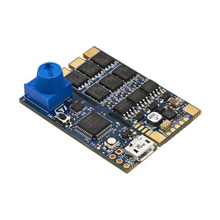
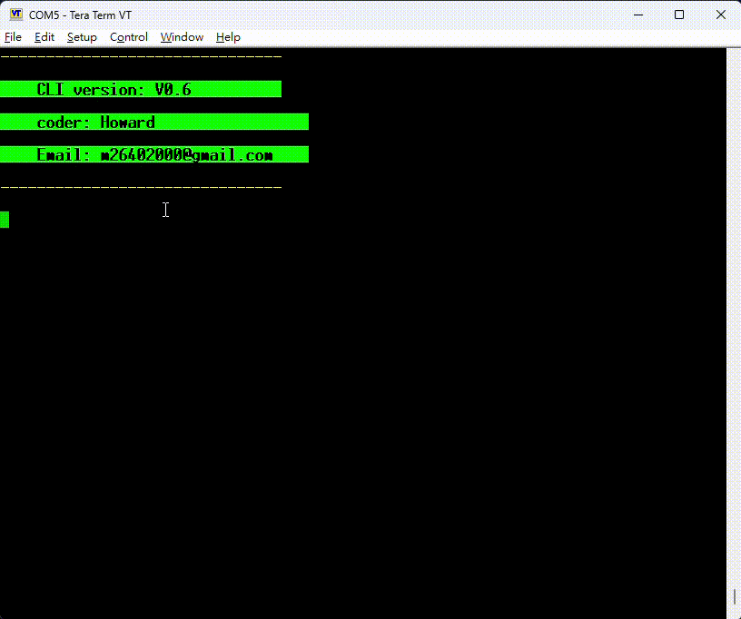
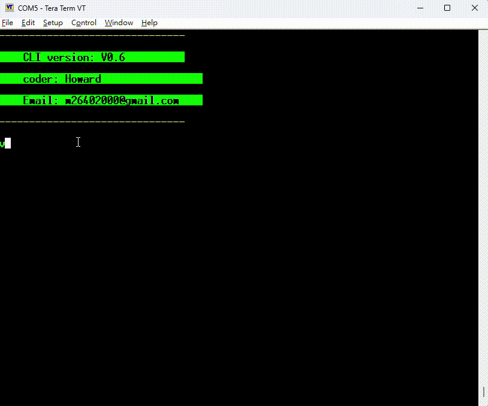

# STM32G431 In Applcation Programming via CLI
## **Description**

1.&ensp;Using CLI: Request version number, software reboot, firmware update.
 
2.&ensp;The application passes noinit varables to Bootloader for IAP without involving other hardware (such as buttons).
And uses UART Ymodem protocol for firmware update.
 
3.&ensp;The application includes an "app descriptor" to confirm whether the firmware update has programmed the correct MCU and flash size.
 
4.&ensp;If you are interested in Bootloader code, you can enter the submodule folder.

 

## **Hardware**

**B-G431B-ESC1:** official demo board 
**USART2:** Pinout PB3, PB4

## **Applcation Demo**

 

## Bootloader Demo
